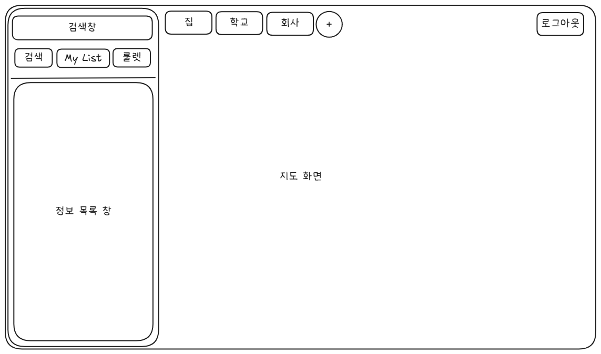

## 2025-11-08
1. (버그) 음식점 검색 후 처음으로 목록이나 마크 클릭 시 map.panTo()가 제대로 작동 안 함
즉, 선택한 음식점이 중앙에 오도록 이동하지 않음.

## 2025-11-10
1. (변경) 현재, 상단의 네비게이션 바에서 지도 홈, My List, 룰렛 탭으로 나눠져있는데,
네비게이션 바 및 정보 표시 영역을 왼쪽 패널로 띄우고 (네이버지도, 카카오맵 참고)
그 외 화면 전체에 지도가 표시된다.
좌측 패널에는 검색 탭, My List 탭, 룰렛 탭이 존재한다.
좌측 패널에 이어서 중앙 상단쪽에는 거점 태그들이 존재한다.
우측 상단에는 로그아웃 버튼이 존재한다.

대략적인 화면 설계는 아래의 이미지 파일과 같다.

2. (추가) 메뉴를 추가할 때, '한 줄 평' 혹은 '한 줄 메모' 를 추가한다.

3. 거점 태그를 저장할 때, 해당 거점의 위치정보도 저장한다.
+ 화면에서 거점 선택 시 지도가 해당 위치를 중심으로 이동한다.
    + 해당 거점 태그에 속한 모든 음식점들이 지도에 마커 표시된다.

4. 검색 시 전국의 모든 데이터를 기준으로 하지 않고, 현재 위치의 주변에 대해서 검색이 이루어질지
아니면 ..등 범위 설정 로직 정하기